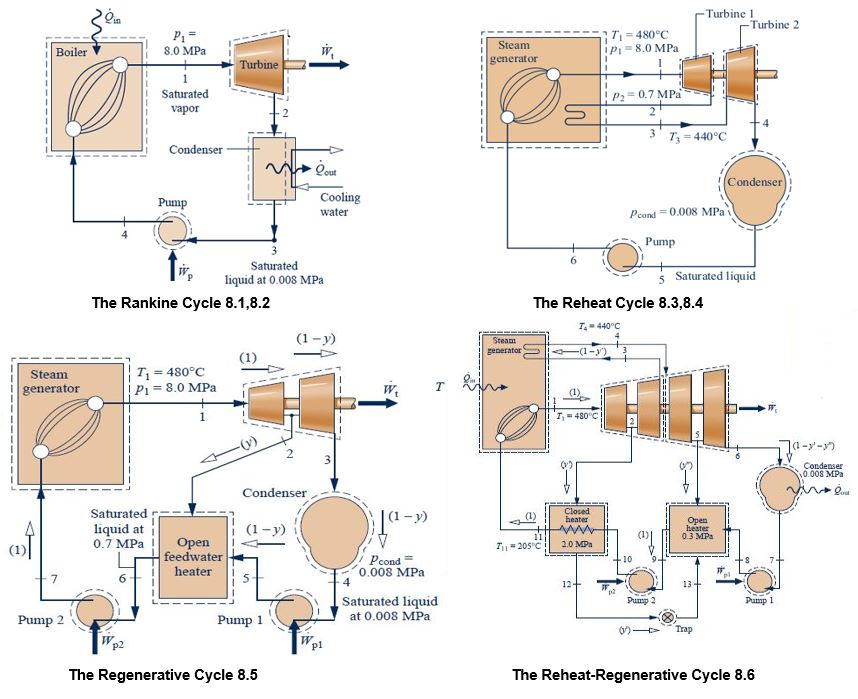

# PyRankine<!-- TOC -->

The **step-by-step codes** of the rankine cycle simulator from zero abstraction to the general abstraction are provided in the  PyRankine.
 
We wish that the PyRankine may be a helpful vehicle for  you to understand **Computational Thinking** and improve the programming skills.

In the PyRankine, the Sample Rankine Cycles are used from [Michael J. Moran. Fundamentals of Engineering Thermodynamics(7th Edition), Chapter 8 : Vapour Power Systems](#the-jupyter-notebooks-of-example-rankine-cycles) 

* [step 0](./step0) :  **Zero Abstraction** of The Ideal Rankine Cycle(Example 8.1)

     The simple data type and expression only 

* [step 1](./step1)  : **Simple Abstraction** of The Ideal Rankine Cycle(Example 8.1)

     Structure data type(List,Dict) and functions
      
* [step 2](./step2) : **Basic Object-Orientation Abstraction** of The Ideal Rankine Cycle(Example 8.1)

     Object-oriented programming 
     
* [step 3](./step3)  : **Basic Object-Orientation Abstraction**  and **Data Representation** of The Ideal Rankine Cycle(Example 8.1)
     
     Object-oriented programming and data files: 

    [Rankine Cycle Representation of CSV or JSON File](./step3/README.md)
                        
    * [step3-csv](./step3/step3-csv)  : csv file 

    * [step3-json](./step3/step3-json): json file
      
* [step 4](./step4) : **General Abstraction** and **Data Representation** of Ideal Rankine Cycle(Example 8.1), Regenerative Cycle with Open Feedwater Heater(Example 8.5)                
    
    Object-oriented programming, general module
                      
    [The UML diagram of the step4-json](./step4/UML-STEP4-JSON.md)
   
    * [step4-csv](./step4/step4-csv): csv file

    * [step4-json](./step4/step4-json): json file       

    * [step4-json-dict](./step4/step4-json-dict): json file  and  `__init__` device with dict, modified the component class       

## Run

```bash
cd step0/1/2/3/4
python rankine.py
``` 

## Dependencies：SEUIF97

* IAPWS-IF97 high-speed shared library

  * https://github.com/PySEE/SEUIF97

## The Jupyter Notebooks of Example Rankine Cycles

Michael J. Moran, Howard N. Shapiro, Daisie D. Boettner, Margaret B. Bailey. Fundamentals of Engineering Thermodynamics(7th Edition). John Wiley & Sons, Inc. 2011

Chapter 8 : Vapour Power Systems 

* [EXAMPLE 8.1: Analyzing an Ideal Rankine Cycle, P438](http://nbviewer.jupyter.org/github/PySEE/PyRankine/blob/master/notebook/RankineCycle81-82-Step0-1.ipynb)

    * [Ideal Rankine Cycle of OOP](http://nbviewer.jupyter.org/github/PySEE/PyRankine/blob/master/notebook/RankineCycle81-Step2.ipynb)

* [EXAMPLE 8.2: Analyzing a Rankine Cycle with Irreversibilities,  P444](http://nbviewer.jupyter.org/github/PySEE/PyRankine/blob/master/notebook/RankineCycle81-82-Step0-1.ipynb)

* [EXAMPLE 8.3: Evaluating Performance of an Ideal Reheat Cycle, P449-451](http://nbviewer.jupyter.org/github/PySEE/PyRankine/blob/master/notebook/RankineCycle83-84-Step0.ipynb)

* [EXAMPLE 8.4: Evaluating Performance of a Reheat Cycle with Turbine Irreversibility, P451](http://nbviewer.jupyter.org/github/PySEE/PyRankine/blob/master/notebook/RankineCycle83-84-Step0.ipynb)

* [EXAMPLE 8.5: The Regenerative Cycle with Open Feedwater Heater, P456](http://nbviewer.jupyter.org/github/PySEE/PyRankine/blob/master/notebook/RankineCycle85-Step0.ipynb)

* [EXAMPLE 8.6: The Reheat–Regenerative Cycle with Two Feedwater Heaters, P460-463](http://nbviewer.jupyter.org/github/PySEE/PyRankine/blob/master/notebook/RankineCycle86-Step0.ipynb)

**Start  the notebooks**

```bash
>startnb.bat
```

**Schematic of Example Rankine Cycles**



## Reference

* Computational thinking

  * [wikipedia: Algorithms + Data Structures = Programs]( https://en.wikipedia.org/wiki/Algorithms_%2B_Data_Structures_%3D_Programs)

  * [wikipedia: Computational thinking]( https://en.wikipedia.org/wiki/Computational_thinking)

  * Jeannette M. Wing. [Computational Thinking Benefits Society]( http://socialissues.cs.toronto.edu/index.html%3Fp=279.html)

* Modeling and Simulation of Engineering Systems

  * R Sinha, Christiaan J. J. Paredis. etc. **Modeling and Simulation Methods for Design of Engineering Systems**. Transactions of the ASME[J]. 2001.03(1):84-91
 
  * MATLAB：Simscape https://cn.mathworks.com/products/simscape.html  

  * OpenMDAO: An open-source MDAO framework written in Python  http://openmdao.org/

  * Modelica
  
    * OpenModelica: An open-source Modelica-based modeling and simulation environment https://openmodelica.org/

      * https://github.com/OpenModelica

    * Michael M.Tiller (作者),  刘俊堂等译. Modelica多领域物理系统建模入门与提高, 航空工业出版社(第1版),2017.05

  * Bond Graph
    * Wolfgang Borutzky. Bond Graph Modelling of Engineering Systems：Theory, Applications and Software Support. Springer Science Business Media, LLC 2011

    * 王中双. 键合图理论及其在系统动力学中的应用, 哈尔滨工程大学出版社,2007.08

* ThermoCycle Simulator 

    * Maarten Winter: pyDNA https://github.com/mwoc/pydna

    * ORC Modeling Kit: https://github.com/orcmkit/ORCmKit

    * ACHP: https://github.com/TSTK/ACHP 

    * Rankine Cycle(Steam Turbine) http://cn.mathworks.com/help/physmod/simscape/examples/rankine-cycle-steam-turbine.html

*  Electronic circuit simulator 

   * Jan M. Rabaey: SPICE http://bwrcs.eecs.berkeley.edu/Classes/IcBook/SPICE/

      * SPICE: https://en.wikipedia.org/wiki/SPICE

   * ahkab：a SPICE-like electronic circuit simulator written in Python https://github.com/ahkab/ahkab

   * 杨华中等. 电子电路的计算机辅助分析和设计方法（第二版），清华大学出版社，北京，2008.02

