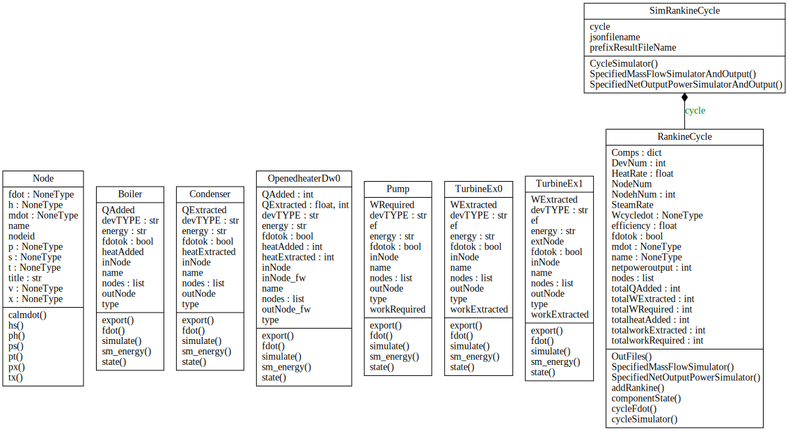

# Step4: General Abstraction and Textual Representation of Rankine Cycle

Object-oriented programming, general module

JSON file of Rankine Cycle Flowsheet
 
**Run**

```bash
>python rankine.py
```

## Example Rankine Cycles

Michael J. Moran, Howard N. Shapiro, Daisie D. Boettner, Margaret B. Bailey. Fundamentals of Engineering Thermodynamics(7th Edition). John Wiley & Sons, Inc. 2011

Chapter 8 : Vapour Power Systems 

* [EXAMPLE 8.1: Analyzing an Ideal Rankine Cycle, P438](http://nbviewer.jupyter.org/github/PySEE/PyRankine/blob/master/notebook/RankineCycle81-82-Step0-1.ipynb)

    * [Ideal Rankine Cycle of OOP](http://nbviewer.jupyter.org/github/PySEE/PyRankine/blob/master/notebook/RankineCycle81-Step2.ipynb)

* [EXAMPLE 8.2: Analyzing a Rankine Cycle with Irreversibilities, P444](http://nbviewer.jupyter.org/github/PySEE/PyRankine/blob/master/notebook/RankineCycle81-82-Step0-1.ipynb)    

* [EXAMPLE 8.5: The Regenerative Cycle with Open Feedwater Heater, P456](http://nbviewer.jupyter.org/github/PySEE/PyRankine/blob/master/notebook/RankineCycle85-Step0.ipynb)

## The UML Class diagram 

### The Class Diagram： Association


### The Class Diagram : Composition



## The Projects 

### [The Textual Representation Files of Rankine Cycle](./txtcycle)

* `rankine??.json`

### [The Output Files of Rankine Cycle](./output) 

* `rankine??-SM.txt`: the output of Specified Mass Flow

* `rankine??-SP.txt`: the output of the Specified Net Output Power

### [The Components Class](./components)

All component classes in the package `components` have these  methods:`__init__`,`state`,`fdot`,`simulate`, `sm_energy`,`export`

### The Rankine Cycle 

* 1 `rankine_cycle.py`:the General Simulator of Rankine Cycle
* 2 `rankine.py` : the main runner of the General Simulator of Rankine Cycle

### The Methods to check and analysis the mass float rate

There are dependencies in the mass float rate calculation.

e.g: [EXAMPLE 8.5: The Regenerative Cycle with Open Feedwater Heater, P456](http://nbviewer.jupyter.org/github/PySEE/PyRankine/blob/master/notebook/RankineCycle85-Step0.ipynb)

If the Open Feedwater Heater is not calculated, the fraction of extraction steam flow from turbine is not obtained, then the
fraction of the total flow passing through the second-stage turbine is also no value, The turbine work calculation cannot be carried out.

That is to say that the Open Feedwater Heater must be calculated **before** the Turbine.

There is a problem of **equipment calculation order** in the mass float rate of Rankine Cycle

What is the solution? Hard-coded Calculation Order? No, It is not the general solution.

In the example codes, we provide one simple general solution:

* the method `fdot` in every component with the method `cycleFdot` in the `rankine_cycle.py`

If you are interested in solutions based on mathematical models,it is advisable to refer to general circuit analysis methods used in [SPICE](http://bwrcs.eecs.berkeley.edu/Classes/IcBook/SPICE/)

## Notes on Python

### 1 Packages
   
   https://docs.python.org/3.6/tutorial/modules.html#packages

   Packages are a way of structuring Python’s module namespace by using **“dotted module names”**.
   The ` __init__.py  `files are required to make Python treat the **directories** as containing **packages**; 
   this is done to **prevent directories with a common name**, such as string, from unintentionally hiding valid modules that occur later on the module search path. 
   
   In the simplest case, ` __init__.py ` can just be an **empty** file, but it can also execute initialization code for the package or set the ` __all__ ` variable

```bash   
   components/                  components package
      __init__.py               Initialize the components package
      boiler.py
      condenser.py
     ...
```

Users of the package can import **individual modules** from the package, for example:

```python
import components.node
```
An alternative way of importing the submodule is:

```python
from components import node
```
Yet another variation is to import **the desired function or variable** directly:

```python
from components.node import Node
```

### 2 Redirect **stdout** to a file

29.1. sys — System-specific parameters and functions

https://docs.python.org/3/library/sys.html

This module provides access to some variables used or maintained by the **interpreter** and to functions that interact strongly with the interpreter. It is always available.

File objects used by the interpreter for standard input, output and errors:

* sys.stdin ： is used for all interactive input (including calls to input());

* sys.stdout ：is used for the output of print() and expression statements and for the prompts of input();

* sys.stderr：The interpreter’s own prompts and its error messages go to stderr.

These streams are regular **text** files like those returned by the open() function. 

```python
import sys
sys.stdout = open('Redirect2file.txt', 'w')
print('Test: redirect sys.stdout to file')
```

### 3 glob — Unix style pathname pattern expansion

https://docs.python.org/3/library/glob.html

The `glob` module finds all the pathnames matching a specified pattern according to the rules used by the Unix shell, although results are returned in arbitrary order. No tilde(~) expansion is done, but `*`, `?`, and character `ranges` expressed with `[]` will be correctly matched

```python
import glob

json_filesname_str='./txtcycle/rankine8[0-9].json'
json_filesname=glob.glob(json_filesname_str)
```

### 4 json — JSON encoder and decoder

Python3: https://docs.python.org/3/library/json.html

**json.load**

```python
json.load(fp, *, cls=None, object_hook=None, parse_float=None, parse_int=None, 
parse_constant=None, object_pairs_hook=None, **kw)
```
Deserialize fp (a .read()-supporting file-like object containing a JSON document) to a Python object using this conversion table.

**json.loads**

```python
json.loads(s, *, encoding=None, cls=None, object_hook=None, parse_float=None, parse_int=None, parse_constant=None, object_pairs_hook=None, **kw)
```
Deserialize s (a str, bytes or bytearray instance containing a JSON document) to a Python object using this conversion table.

```python
def read_jsonfile(filename):
    """ rankine cycle in json file"""

    # 1 read json file to dict
    with open(filename, 'r') as f:
        rkcyc = json.load(f)
        #rkcyc = json.loads(f.read())
```

### 5 object__dict__ & update([other])

**update([other])**

  * Update the dictionary with the key/value pairs from other, overwriting existing keys. Return None.

  * `update()` accepts either another dictionary object or an iterable of key/value pairs (as tuples or other iterables of length two). If keyword arguments are specified, the dictionary is then updated with those key/value pairs: d.update(red=1, blue=2).

**object.\_\_dict__**

*  A dictionary or other mapping object used to store an object’s (writable) attributes.

```python
class Boiler:
  
      def __init__(self,dictDev):
         
         self.__dict__.update(dictDev) 
          
        # self.name = dictDev['name']
        # self.type = dictDev['type']
        # self.inNode = dictDev['inNode']
        # self.outNode = dictDev['outNode']
```   

